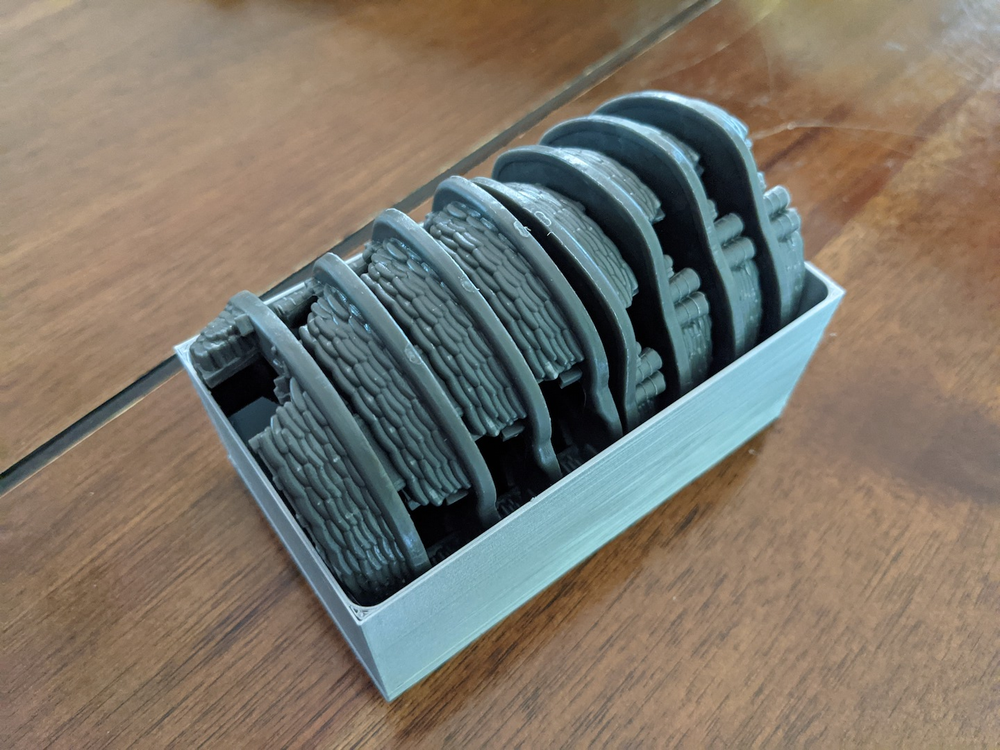

# Company of Heroes Board Game Emplacement Tray

This model is designed to hold the emplacement models in the [Company of Heroes: Ruins of War – Terrain Pack 2](https://gamefound.com/projects/companyofheroes/1/products/details/5264#/).  The tray is designed to fit inside the cathedral model, as the emplacement were originally packaged.

The tray was modeled in [OpenSCAD](https://openscad.org/).  The script is available [here](cohbg-emplacement-tray.scad).

