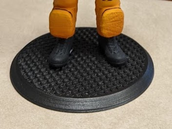

When I printed the [Advanced Crew Escape Suit (Pumpkin Suit)
by MaxGrueter](https://www.thingiverse.com/thing:3276201) as gift, I decided it needed a themed base. I scripted this in OpenSCAD, which made it really easy to produce the grating and experiment with difference gauges and gaps in the grating.  

I eventually put magnets in the base and the feet of the model.  This was done manually and are not reflected in the model.  If I were to revisit this project, I would consider adding holes for the magnets in the models.

