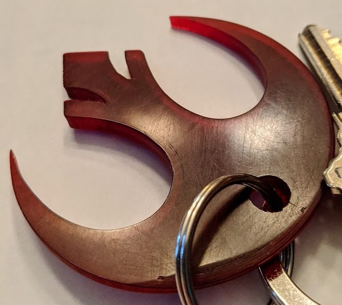

# Star Wars Rebel Alliance Key Chain

> Please use at your own risk and in accordand to your juridications.

I designed this after my daughter told be about the cat shaped self defense key chains.  I thought "There's got to a more geeky logo that could be used."  I looked at the emblem for the Jedi Order, but it's too delicate, I wanted something beefier.  The Reble Allience logo seemed a better fit.

This is based off the [Star Wars Rebel Logo by ty10y](www.thingiverse.com/thing:1030033) model on thingiverse.  I also referenced the [Self Defense Cat Keychain (Whiskers Filled) by DeathShiva](https://www.thingiverse.com/thing:3049773) for scale.  Thanks to both for the resources.

The SCAD file imports `StarWarsRebel.stl` [(direct link)](https://cdn.thingiverse.com/assets/8e/1a/6c/09/57/StarWarsRebel.stl) from the ty10y project in the same directory.  You will need to download the file yourself.

For the final print, I used a red transparent filament from Prusa.  This picture looks a little rough, but reflects being carried for several months.

